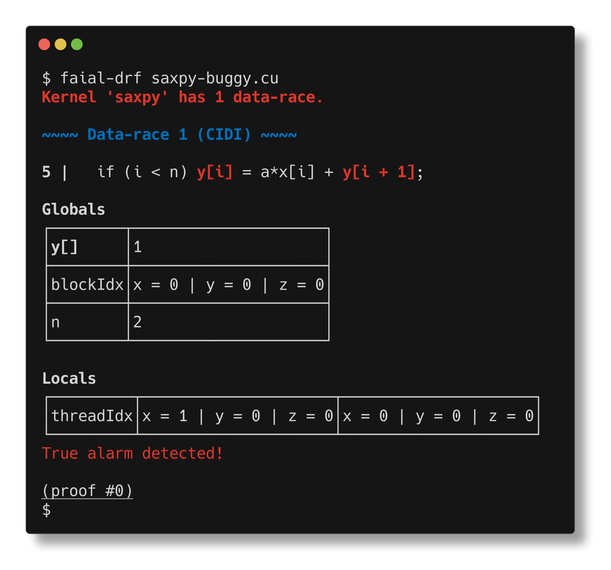

# Tutorial on using Faial, a static analyzer for CUDA kernels

[Faial](https://gitlab.com/umb-svl/faial/) is a static analyzer for CUDA kernels that can help you detect
data-race free kernels and racy kernels without needing inputs. For installation details, please go to [Faial's web page](https://gitlab.com/umb-svl/faial/).

# Checking a CUDA kernel


The following example is a classic [SAXPY CUDA kernel](https://developer.nvidia.com/blog/easy-introduction-cuda-c-and-c/).

```c
$ cat saxpy.cu
__global__
void saxpy(int n, float a, float *x, float *y)
{
  int i = blockIdx.x*blockDim.x + threadIdx.x;
  if (i < n) y[i] = a*x[i] + y[i];
}
```

We can check that `saxpy.cu` is data-race free (DRF) by running `faial-drf`:


# Checking a racy CUDA kernel

Let us now check a buggy protocol `saxpy-buggy.cu`. The difference between
`saxpy.cu` and `saxpy-buggy.cu` is simply changing the last read from `y[i]`
into `y[i + 1]`.


```
$ diff -u saxpy.cu saxpy-buggy.cu 
--- saxpy.cu	2021-04-19 16:28:24.407379028 -0400
+++ saxpy-buggy.cu	2021-04-20 10:41:26.317324409 -0400
@@ -2,5 +2,5 @@
 void saxpy(int n, float a, float *x, float *y)
 {
   int i = blockIdx.x*blockDim.x + threadIdx.x;
-  if (i < n) y[i] = a*x[i] + y[i];
+  if (i < n) y[i] = a*x[i] + y[i + 1];
 }
\ No newline at end of file
```


`faial-drf` can now inform us of the data-race.



The error report consists of:
 * the source location (line 5) of the error, along with both access being highlighted (here underline)
 * In the table labelled `Global`, we have the state of thread-global program variables. An important characteristic of thread-global variables, is that threads observe the same value. Variable index represents the array index being accessed. Next, we have the value of variables `blockDim.x` and `n`. 
 * Next, we have the runtime state of thread-local variables (table `Locals`). There is one
   column per thread causing the data-race. In this case one thread
   `threadIdx.x=0` races with tread `threadIdx.x=1`.


# Try it yourself, using GitHub Actions

Faial is available in the GitHub Action Marketplace as
[`cogumbreiro/setup-faial`](https://github.com/marketplace/actions/setup-faial).


To make `faial-drf` available in the `PATH`, simply add a step that uses
`cogumbreiro/setup-faial@v1.0`. Here's an example of how we setup Faial in
this repository to automatically check that `saxpy.cu` is data-race free.

```yaml
on: [push]

jobs:
  check_drf:
    runs-on: ubuntu-latest
    name: Check that saxpy.cu is DRF.
    steps:
    - name: Check out code
      uses: actions/checkout@v1
    - name: Setup faial
      uses: cogumbreiro/setup-faial@v1.0
    - name: Check saxpy
      run: |
        faial-drf saxpy.cu
```
