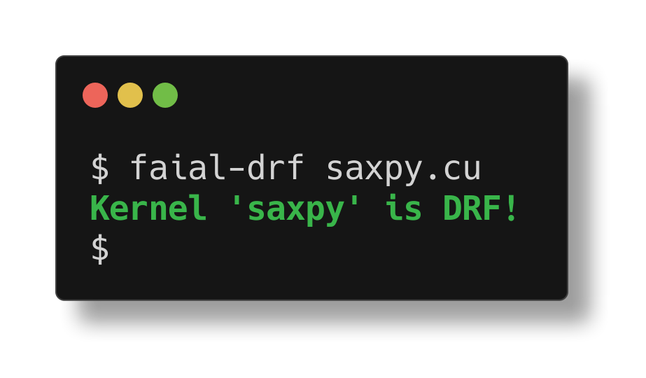

# Using Faial a static analyzer for CUDA kernels

[Faial](https://gitlab.com/umb-svl/faial/) is a static code analyzer for CUDA
kernels that can help you detect data-race free kernels and racy kernels
**without running the program and for all possible inputs**.
* [Installing Faial (external link)](https://gitlab.com/umb-svl/faial/)
* [Setting up a GitHub Actions project](github-actions/README.md)
* [Using command line options](command-line-options/README.md)
* [Adding assumptions](adding-assumptions/README.md)

# Detecting data-races


The file `saxpy-buggy.cu` is a **buggy** [SAXPY CUDA kernel](https://developer.nvidia.com/blog/easy-introduction-cuda-c-and-c/).

```c
__global__ void saxpy(int n, float a, float *x, float *y)
{
  int i = blockIdx.x*blockDim.x + threadIdx.x;
  if (i < n) y[i] = a*x[i] + y[i + 1];
}
```

Running `faial-drf saxpy-buggy.cu` shows us the root cause and a program state
that triggers the data-race. 

The error report consists of:
 * the source location (line 5) of the error, along with both access being highlighted (here underline)
 * In the table labelled `Global`, we have the state of thread-global program variables. An important characteristic of thread-global variables, is that threads observe the same value. Variable index represents the array index being accessed. Next, we have the value of variables `blockDim.x` and `n`. 
 * Next, we have the runtime state of thread-local variables (table `Locals`). There is one
   column per thread causing the data-race. In this case one thread
   `threadIdx.x=0` races with tread `threadIdx.x=1`.

# Detecting error-free kernels

The fixed version of our example is in `saxpy.cu`. Here is how these two
files differ:

```diff
$ diff -u saxpy-buggy.cu saxpy.cu
--- saxpy-buggy.cu	2021-04-20 10:41:26.317324409 -0400
+++ saxpy.cu	2021-04-19 16:28:24.407379028 -0400
@@ -2,5 +2,5 @@
 void saxpy(int n, float a, float *x, float *y)
 {
   int i = blockIdx.x*blockDim.x + threadIdx.x;
-  if (i < n) y[i] = a*x[i] + y[i + 1];
+  if (i < n) y[i] = a*x[i] + y[i];
 }
\ No newline at end of file
```

Running `faial-drf saxpy.cu` informs us that there are no data races in **all
possible executions**.



