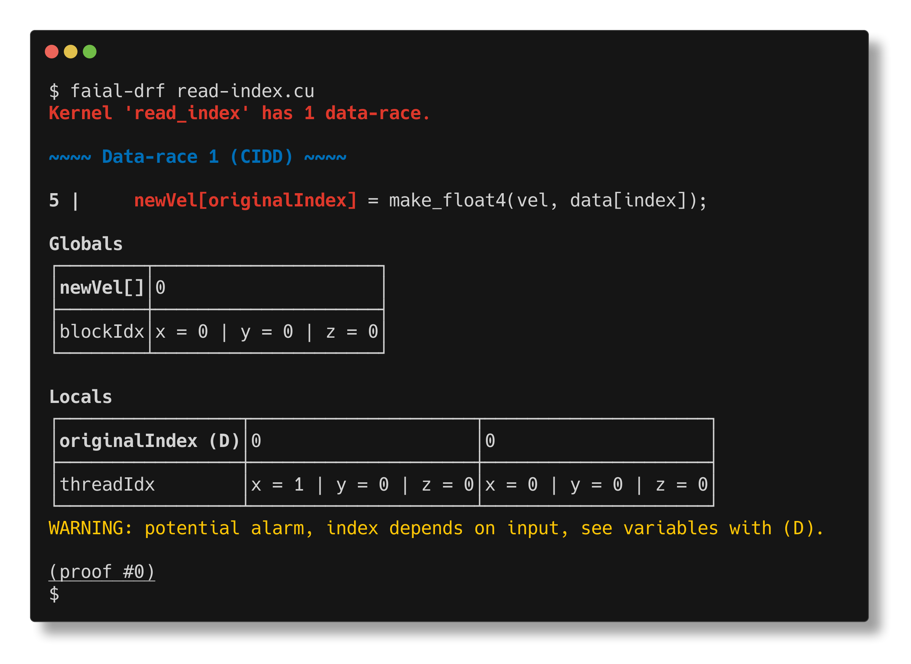
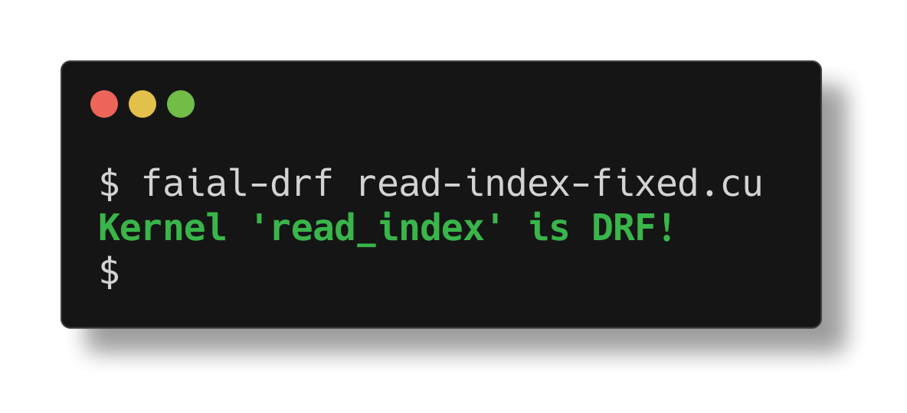

# Adding assumptions

*Assumptions provide missing information that aids Faial in analyzing code.*
In the following example, Faial reports a **potential** data-race which
results from two threads reading the same index into `originalIndex` and then
the two threads writing to `newVel[0]`.

```C
__global__ void read_index(uint* indices, float4 *newVel, float3 vel, float* data) {
    uint index = threadIdx.x * blockDim.x + blockIdx.x;
    uint originalIndex = indices[index];
    newVel[originalIndex] = make_float4(vel, data[index]);
}
```



The user may know that the contents of array `indices` is distinct numbers,
which makes the data-race impossible. We can inform `faial-drf` of this
problem with an assertion `__assume(__distinct_int(originalIndex))`:
```patch
$ diff -u read-index.cu read-index-fixed.cu 
--- read-index.cu	2024-04-14 14:44:06.527855727 -0400
+++ read-index-fixed.cu	2024-04-14 14:43:57.323693112 -0400
@@ -2,5 +2,6 @@
 __global__ void read_index(uint* indices, float4 *newVel, float3 vel, float* data) {
     uint index = threadIdx.x * blockDim.x + blockIdx.x;
     uint originalIndex = indices[index];
+    __assume(__distinct_int(originalIndex));
     newVel[originalIndex] = make_float4(vel, data[index]);
 }
```




* CUDA's [`__assume(bool)`](https://docs.nvidia.com/cuda/cuda-c-programming-guide/#assume) allows the compiler to assume that the given condition.
* Function `__distinct_int(int)` informs `faial-drf` that the thread-local value of `originalIndex` is distinct across all threads. 

