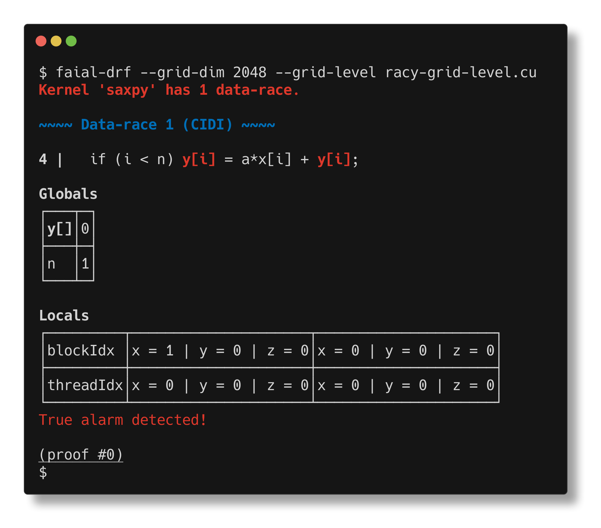

# Common command line options

## Grid and block dimension

We can set the thread geometry with the command line option `--block-dim` to
set variable `blockDim` and `--grid-dim` to set `gridDim`. Since `blockDim`
and `gridDim` are a 3D vector, of type `dim3`, we allow setting the 3 dimensions
with the following example:
- `--block-dim 1024` sets `blockDim.x=1024`, `blockDim.y=1` and `blockDim.z=1`
- `--block-dim [1024,32]` sets `blockDim.x=1024`, `blockDim.y=32`, and `blockDim.z=1`
- `--block-dim [1024,32,64]` sets `blockDim.x=1024`, `blockDim.y=32`, and `blockDim.z=64`

## Grid level analysis

Faial only checks block-level data-races by default. The command line option
`--grid-level` enables grid-level analysis.

For instance, the following kernel `racy-grid-level.cu` has a data-race at the
grid level, but not at the block level. We run `faial-drf --grid-dim 2048
--grid-level racy-grid-level.cu` to detect a data-races when running 2048
blocks.

## Adding include directories

The command line option `-I <dir>` adds the given directory to the end of the
list of include search paths.

## Setting macros

- `-D` to define a macro

## Checking a single kernel

- `--kernel` by default Faial analyzes all kernels in the input; this option restricts the analysis to a single kernel.
