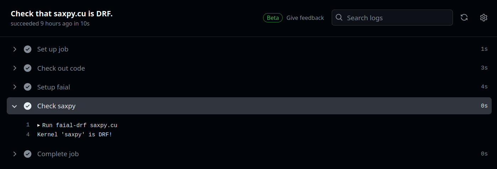

# Setting up Faial with GitHub Actions

Faial is available in the GitHub Action Marketplace as
[`cogumbreiro/setup-faial`](https://github.com/marketplace/actions/setup-faial),
which allows checking kernels with `faial-drf` whenever a commit is pushed.



The step `cogumbreiro/setup-faial@v1.0` makes `faial-drf` available in the
`PATH`. File [`./github/workflows/run.yaml`](/.github/workflows/run.yml) performs as follows:
1. checks out the code, with `actions/checkout@v1`
2. adds `faial-drf` to the `PATH`, with `cogumbreiro/setup-faial@v1.0`
3. ensures that `saxpy.cu` is data-race free, with `faial-drf saxpy.cu`
4. checks that `saxpy-buggy.cu` is racy, with `! faial-drf saxpy-buggy.cu`

```yaml
on: [push]

jobs:
  check_drf:
    runs-on: ubuntu-latest
    name: Check that saxpy.cu is DRF.
    steps:
    - name: Check out code
      uses: actions/checkout@v1
    - name: Setup faial
      uses: cogumbreiro/setup-faial@v1.0
    - name: Check saxpy.cu
      run: |
        faial-drf saxpy.cu
    - name: Check saxpy-buggy.cu
      run: |
        ! faial-drf saxpy-buggy.cu
```

